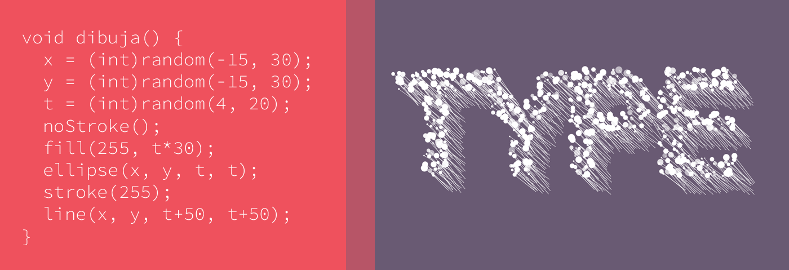

# Tipogen_set04

## Description

Tipogen_set04 is an open-source generative typography project created using Processing. This repository contains the source code and assets necessary to programmatically generate unique typographic compositions.

## File Structure

- **Fonts**: Contains final version fonts used in the project.
- **resources**: Repository for various materials related to the project.
- **sources**: Glyphs and .fea files.
- **[specimen](./specimen/Specimen_Color.pdf)** files.
- **Tipogen_Set04_BT**: Processing generative code for creating typography.

## Features

- **Generative Typography**: Utilizes algorithms to dynamically create diverse typographic designs.
- **Customization**: Parameters can be adjusted to control various aspects of the typography, such as font style, size, color, arrangement, and more.
- **Creative Exploration**: Offers a platform for exploring creative possibilities in typography through code.

## Usage

1. Install Processing IDE from [Processing.org](https://processing.org/download/).
2. Clone this repository to your local machine using `git clone`.
3. Open the project in Processing IDE.
4. Run the sketch to generate a new typographic composition. Use the key "e" to export to pdf
5. Experiment with the parameters in the code to customize the output according to your preferences.

## Examples

 
*Generated Typography Example 1*

 
*Generated Typography Example 2*

 
*Generated Typography Example 3*

## Credits

This project is inspired by the intersection of art, design, and technology. It was created by Manuel Guerrero and is open for contributions and collaborations. Special thanks to Alfonso Alba. Visit my website at [bluetypo.com](https://bluetypo.com).

## License

This project is licensed under the [MIT License](LICENSE), with the fonts used being subject to the SIL Open Font License (OFL) 1.1. For more information, please see the [OFL.txt](OFL.txt) file.

## Contributing

Contributions are welcome! Feel free to open issues or pull requests for any improvements or suggestions.

## Acknowledgments

Special thanks to the Processing community and Typography community (AMT) Mexican Association of Typography for their support and resources in creative coding and typographic exploration.
